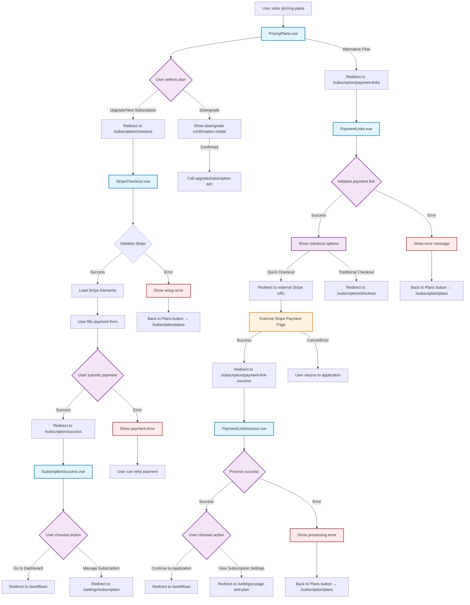

# Payment Flow Diagram

This document describes the complete payment flow for the subscription system, including all redirect links and page transitions.

## Overview

The payment system supports two main checkout methods:
1. **Traditional Stripe Checkout** - Direct integration with Stripe Elements
2. **Payment Links** - External Stripe-hosted checkout pages

## Payment Flow Architecture



## Page Descriptions

### 1. PricingPlans.vue (`/pricing-plans`)
- **Purpose**: Display available subscription plans with pricing
- **Key Features**:
  - Monthly/yearly billing toggle
  - Plan comparison
  - Current plan indication
  - Upgrade/downgrade functionality
- **Redirects**:
  - Upgrade/New: `VIEWS.SUBSCRIPTION_CHECKOUT` (`/subscription/checkout`)
  - Downgrade: Shows confirmation modal, then calls API
  - Error recovery: Shows error messages inline

### 2. StripeCheckout.vue (`/subscription/checkout`)
- **Purpose**: Traditional Stripe Elements checkout form
- **Key Features**:
  - Stripe Elements integration
  - Order summary display
  - Payment form validation
  - Trial period handling
- **Redirects**:
  - Success: `/subscription/success`
  - Error: Back to `/subscription/plans`

### 3. SubscriptionSuccess.vue (`/subscription/success`)
- **Purpose**: Confirmation page for successful traditional checkout
- **Key Features**:
  - Success confirmation
  - Subscription details display
  - Trial information
  - Next steps guidance
- **Redirects**:
  - Dashboard: `/workflows`
  - Manage: `/settings/subscription`

### 4. PaymentLinks.vue (`/subscription/payment-links`)
- **Purpose**: Alternative checkout using Stripe Payment Links
- **Key Features**:
  - Two checkout options
  - External Stripe link generation
  - Fallback to traditional checkout
- **Redirects**:
  - External: Stripe-hosted payment page
  - Traditional: `/subscription/checkout`
  - Error: Back to `/subscription/plans`

### 5. PaymentLinkSuccess.vue (`/subscription/payment-link-success`)
- **Purpose**: Success page for Stripe Payment Links
- **Key Features**:
  - Payment confirmation
  - Subscription details
  - Webhook processing wait
- **Redirects**:
  - Application: `/workflows`
  - Settings: `/settings/usage-and-plan`
  - Error: Back to `/subscription/plans`

### 6. PlanComparisonTable.vue
- **Purpose**: Reusable component for plan feature comparison
- **Usage**: Imported and used by PricingPlans.vue
- **Status**: ✅ **In Use** - Component, not a standalone page

## API Integration Points

### Subscription Store Methods
- `loadAvailablePlans()` - Load available subscription plans
- `loadCurrentSubscription()` - Get current user subscription
- `getPlanById(id)` - Get specific plan details
- `createSubscriptionSetup()` - Initialize traditional checkout
- `createRecurringSubscription()` - Complete traditional checkout
- `createPaymentLink()` - Generate Stripe Payment Link
- `upgradeSubscription()` - Process subscription changes

### External Services
- **Stripe Elements** - For traditional checkout form
- **Stripe Payment Links** - For external hosted checkout
- **Stripe Webhooks** - For payment confirmation processing

## Route Configuration

All payment routes are properly configured in the router:

```typescript
// Main pricing page
{ path: '/pricing-plans', name: VIEWS.PRICING_PLANS, component: PricingPlansView }

// Traditional checkout flow
{ path: '/subscription/checkout', name: VIEWS.SUBSCRIPTION_CHECKOUT, component: StripeCheckoutView }
{ path: '/subscription/success', name: VIEWS.SUBSCRIPTION_SUCCESS, component: SubscriptionSuccessView }

// Payment links flow
{ path: '/subscription/payment-links', name: VIEWS.PAYMENT_LINKS, component: PaymentLinksView }
{ path: '/subscription/payment-link-success', name: VIEWS.PAYMENT_LINK_SUCCESS, component: PaymentLinkSuccessView }
```

## Error Handling & Recovery

### Common Error Scenarios
1. **Plan not found** - Redirect to pricing plans
2. **Payment setup fails** - Show error with retry option
3. **Payment processing fails** - Allow form resubmission
4. **Network issues** - Show appropriate error messages
5. **Webhook processing delays** - Wait and refresh subscription data

### Recovery Mechanisms
- All error states provide "Back to Plans" buttons
- Payment errors allow form retry without losing data
- Loading states prevent duplicate submissions
- Toast notifications provide user feedback

## Security Considerations

1. **Client-side validation** - Form validation before submission
2. **Stripe integration** - Secure token handling
3. **API authentication** - All requests require user authentication
4. **Error information** - Avoid exposing sensitive error details
5. **HTTPS enforcement** - All payment pages require secure connections

## Status Summary

✅ **All payment-related Vue components are actively used and properly connected**

- PricingPlans.vue ✅ Main entry point
- StripeCheckout.vue ✅ Traditional checkout
- SubscriptionSuccess.vue ✅ Traditional success page
- PaymentLinks.vue ✅ Alternative checkout method
- PaymentLinkSuccess.vue ✅ Payment links success page
- PlanComparisonTable.vue ✅ Reusable component

**No unused or unnecessary payment-related Vue pages were found.**

The payment flow is well-structured with proper error handling, user guidance, and multiple checkout options to accommodate different user preferences and technical requirements.
